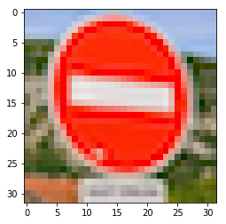
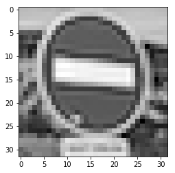
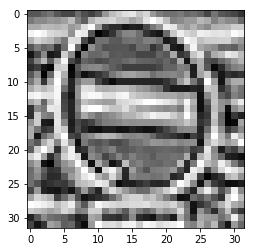

#**Traffic Sign Recognition** 

##Data Set Summary & Exploration

The code for this step is contained in the second code cell of the IPython notebook.  

I used the numpy library to calculate summary statistics of the traffic
signs data set. The data is made up of 32x32 images with 3 layers (red, green, and blue).

* The size of training set is 34799
* The size of test set is 12630
* The number of unique classes/labels in the data set is 43

There are 43 different classes of signs in the data set. Here's a few example of them:

Additional exploration was on the third through fifth code cell.

##Design and Test a Model Architecture

The first step I take with the dataset is to grayscale and normaliza the value between 0 and 1. During the exploration process, I tried different approaches comparing grayscale to RGB, and grayscale always resulted in better accuracy. It seems that the color of the sign itself provides little information of its classifcation.

Second step was to crop the images a bit further. Most images of signs didn't extend all the way to the edge of the signs, so by cropping I was able to reduce possible noise to the neural network.

As a final step, I applied an adaptive histogram filter to the image. Histogram spreads out the highest intensity points, which helped improve the classification.

Here is an example of a traffic sign image before and after grayscaling:

After grayscaling:

After adaptive histogram:

After applying pre-processing to the training set, I augmented the data by applying different transformations with a few random variations. The transformations were applied in this order:

- Brightness modification
- Image warping
- Image scaling (zooming in/out)
- Image translattion



## Data Split

The data was split in 3 different sets:

- Training: Set of data used to train the neural network on each epoch
- Validation: Set of data to validate the performance of the neural network on each epoch 
- Testing: The testing set is not used until the netowrk is done training, and it's used to test the accuracy on a set not previously "seen" by the model. The discrepancy between the accuracy during training and the accuracy on the testing set helped identify issues with the model. Ex.: overfitting training data

The data is separated from a pickle file containing all the data on the first code cell.

### Architecture

The architecture used in the network is a modified LeNet architecture.

The final architecture consisted of the following layers:

- Convolution layer with 5x5 filters and a 1x1 VALID strides and 32 depth output. ReLU activation and a MaxPooling of 2x2
- Convolution layer with 5x5 filters and a 1x1 VALID strides and 64 depth output. ReLU activation and a MaxPooling of 2x2
- Fully connected layer with 240 nodes with ReLU activation and a 65% dropout.
- Fully connected layer with 100 nodes with ReLU activation and a 65% dropout.
- Fully connected layer with the 43 output nodes.

#### Finding the Solution

The LeNet architecture was a good starting point for the network. I first set it up and left it untouched so I could have a working network to use while testing different pre-processing technicques.

The first on pre-processing was to determine whether I should stick with RGB channels or grayscale. On all my tests grayscale provided a better score over RGB.

Next, I tried different image filters. I tried different combinations of modifying image brightness, blue, sharpening. The filter that provided the best result was adaptive histogram.

I also experimented with cropping the image on the edges, as most images didn't seem to have any relevant information on the borders and were only noise to the network. I ended up cropping 2 pixels around the edges, with a final image resolution of 28x28.

After I was happy with my pre-processing, started tunning the network. My first step was to add a few dropout step after each layer. I played with values between 0.4 and 0.65, and ended up settling on 0.65. That hyper parameneter didn't resulted in very different accuracy scores.

I had better results increasing the depth of each convolution layer. I increased the first layer to a depth of 32, and the second to a depth of 64, and modified the fully connected layers to 240, 100, and 43.

#### Tunning Hyperparameters

The training code is located between cell 8 and 12. I've experimented with different numbers of epochs, learning rate, and batch size.

Initially, I had an assumption that the batch size didn't imapcted the training model, and should be tuned just as a way to optimize for the hardware in which the model is being trained. The bigger the batch size, the faster it would train, but would require more memory also. After some research and discussion with my peer Udacity colleagues, I learned that the batch size could also impact the training score. After playing with different numbers, I left the batch size at 4098, which was a decent compromize between training time and score impact.

For the training rate, I played with different numbers, starting with 0.01 (based on LeNet). Reducing the the learning rate resulted in better score. I reduced all the way down to 0.001. Lower than that didn't improve the score.

For the different iterations, I played with epoch numbers between 50 and 150. When I dentified that after a certain number of epochs didn't increase the accuracy anymore, I would leave the network at that number of epoch. Tunning other hypyer parameters required the epoch numbers to be tuned. 

My final score was the following 0.991 for the validation set, and 0.97 for the test set.
 

##Test a Model on New Images

Here are five German traffic signs that I found on the web:

I wasn't able to find noisy or bad quality images, however I noticed that although the images I found are somewhat clear for a human to identify, they look very differently than the images used to train the algorithm. (sharper colors, different angles, constrast, brightness, etc).

However, the modal was able to predict all the images correctly, giving 100% accuracy. Looking at the softmax, it's easy to identify that the model was very certain of the predication. All images but first and fourth had 100% softmax probability. Here's the softmax for the ones that didn't had 100% (16th code cell):

#### First Image (Yield)

| Probability         	|     Prediction	        					| 
|:---------------------:|:---------------------------------------------:| 
| 0.995        			| Yield   									| 
| 0.004     				| No entry							|
| 0.001					| Stop				

#### Fourth Image (Go straight or right)

| Probability         	|     Prediction	        					| 
|:---------------------:|:---------------------------------------------:| 
| 0.934        			| Go straight or right   									| 
| 0.065     				| Ahead only							|
| 0.001					| Traffic signals

For a test, I took a sample of another "Go straight or right" image from the training set to compare the softmax with the softmax of the fourth image above. The result is as follow:		

#### Additional "Go straight or right" Image

| Probability         	|     Prediction	        					| 
|:---------------------:|:---------------------------------------------:| 
| 0.999        			| Go straight or right   									| 
| 0.000     				| Turn left ahead							|
| 0.000					| Stop

The softmax of the train data set is more certain than the additional images, besides the new images being much clearer and better quality. That might point to some overfitting to the train data, or at least to the type and quality of image used to train the model.

However, given the similar scores that the model got between training, test, validation, and the 5 additional images, it seems that the model generalizing well. The 5 new images got 100% accuracy, while the validation set got 97%.